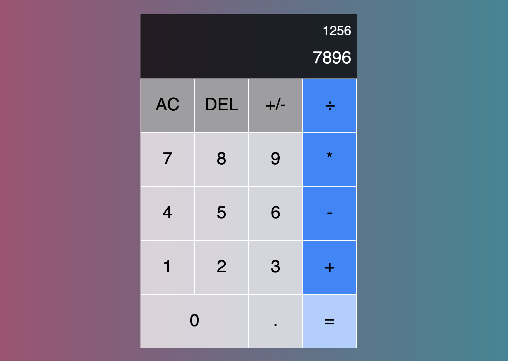

# Calculator
My version of a [simple calculator](https://heyitsdiego.github.io/calculator/) using JavaScript. Part of The Odin Project's Web Development 101 curriculum.

# Calculator

My version of a simple calculator. 

[Link to live project](https://heyitsdiego.github.io/calculator/)

## Preview

## Built With
* HTML
* CSS
* Vanilla Javascript